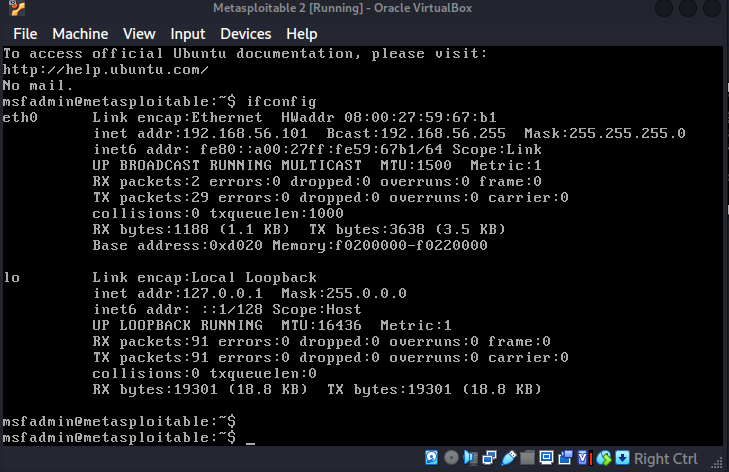
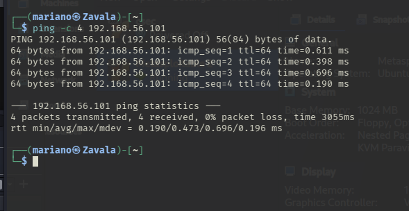
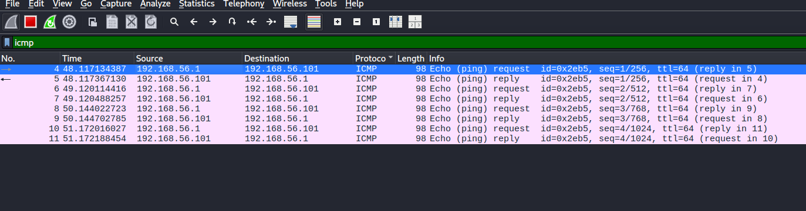

# 🏗️ Semana 1: Arquitectura SOC y Aislamiento de Red (Air-Gapped)

## 🎯 Objetivo
Desplegar un entorno de laboratorio seguro y realista para la simulación de ciberataques y prácticas de Blue Team. El enfoque de esta semana fue la creación de una red aislada para contener sistemas vulnerables sin comprometer la red física principal.

## 🛠️ Arquitectura Implementada
* **Atacante / Sensor (Host):** Kali Linux (Bare-Metal).
* **Víctima (Target):** Metasploitable 2 (Máquina Virtual en VirtualBox).
* **Red Virtual:** Adaptador Solo Anfitrión (`vboxnet0`).

## 🚀 Acciones Técnicas Realizadas
1.  **Despliegue de Víctima:** Importación del disco virtual (`.vmdk`) de Metasploitable 2 en VirtualBox.
2.  **Aislamiento de Red:** Configuración de un switch virtual (`vboxnet0`) con servidor DHCP habilitado para asegurar que la máquina vulnerable no tenga salida a internet (Air-Gapped Environment).
3.  **Validación de Telemetría:** Verificación de conectividad (ICMP Ping) desde Kali Linux hacia la IP de la víctima (`192.168.56.101`).
4.  **Captura de Tráfico:** Monitoreo exitoso de la interfaz virtual `vboxnet0` utilizando **Wireshark** para confirmar la visibilidad de los paquetes en la red interna.
## 📸 Evidencia

**1. Dirección IP de la víctima (Metasploitable)**

**2. Prueba de conectividad aislada (Ping desde Kali)**

**3. Validación de telemetría en switch virtual (vboxnet0)**

