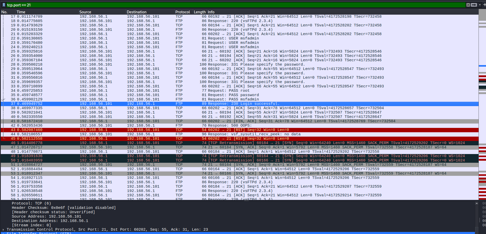
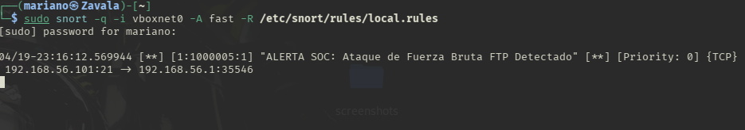

# 🛡️ Semana 2: Fuerza Bruta, Texto Plano y Detección de Firmas (IDS)

## 🎯 Objetivo
Emular un ataque de fuerza bruta contra protocolos de administración sin cifrado (FTP) y desarrollar una regla de detección matemática en Snort para identificar la firma del atacante mediante el control de umbrales.

## 🛠️ Herramientas Utilizadas
* **Ofensiva:** Hydra (Ataque de diccionario).
* **Defensiva:** Snort (Sensor IDS) y Wireshark (Análisis Forense de Paquetes).

## 🚀 Acciones Técnicas y Análisis Forense
1. **Emulación de Adversario:** Se ejecutó un ataque de diccionario con Hydra contra el puerto 21 (FTP) del servidor víctima, logrando vulnerar la credencial `msfadmin`.
2. **Análisis de Protocolos Inseguros:** Al inspeccionar el tráfico en Wireshark, se demostró el riesgo de usar protocolos sin cifrar, observando las credenciales viajar en texto plano (`Request: PASS`).
3. **Firma del Atacante:** Se identificó la huella de la herramienta automatizada, la cual genera una cascada de cierres de conexión abruptos (`RST, ACK`) tras cada intento fallido, saturando al servidor (`500 OOPS`).
4. **Ingeniería de Detección (Tuning):** Se creó una regla personalizada en Snort utilizando la directiva `detection_filter`. Se ajustó el umbral (`count`) para cazar la ráfaga exacta de respuestas `530 Login incorrect` evadiendo la trampa de falsos negativos.

## 📸 Evidencia Forense

**1. Ataque automatizado exitoso (Hydra)**

**2. Captura de credenciales en texto plano y firmas RST (Wireshark)**

**3. Sensor IDS mitigando la amenaza en tiempo real (Snort)**

